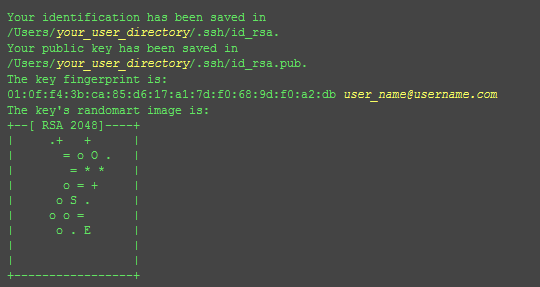
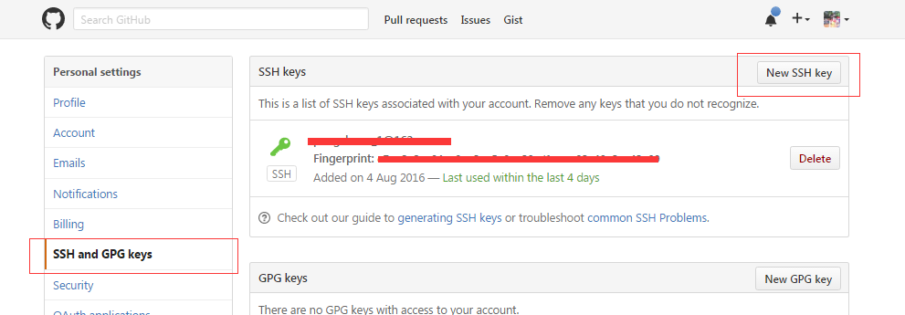

想好好写写博客了，又不喜欢那些平台各种花哨和广告。看好多大神都是用的hexo搭建的自己的博客，我也跟风搞一个，下面记录下过程以及遇到的坑。 
## 1.安装git和node.js
安装完git后，进入git bash配置ssh key
首先检查电脑现有ssk key，执行命令`$ cd ~/.ssh`,如果提示No such file or directory 说明你是第一次使用git。
生成新的ssh key：
`$ ssh-keygen -t rsa -C"邮件地址@youremail.com"Generating public/private rsa key pair. Enter file in which to save the key(/Users/your_user_directory/.ssh/id_rsa):<回车就好>`
注意1: 此处的邮箱地址，你可以输入自己的邮箱地址；注意2: 此处的「-C」的是大写的「C」
然后系统会要你输入密码：
`Enter passphrase (empty forno passphrase):<输入加密串> `
`Enter same passphrase again:<再次输入加密串>`         
最后看到这样的界面，就成功设置ssh key了：

添加 SSH Key 到 GitHub（如果没有注册github账号，请先行注册，很简单）
1.打开本地C:\Documents and Settings\Administrator.ssh\id_rsa.pub文件。此文件里面内容为刚才生成人密钥。如果看不到这个文件，你需要设置显示隐藏文件。准确的复制这个文件的内容，才能保证设置的成功。
2.登陆github系统。点击右上角的 Settings—>SSH and GPG keys —> New SSH key
3.把你本地生成的密钥复制到里面（key文本框中）， 点击 add key 就ok了

可以输入下面的命令，看看设置是否成功，git@github.com的部分不要修改：
`$ ssh -T git@github.com`
如果是下面的反馈：
The authenticity of host 'github.com (207.97.227.239)' can't be established.
RSA key fingerprint is 16:27:ac:a5:76:28:2d:36:63:1b:56:4d:eb:df:a6:48.
Are you sure you want to continue connecting (yes/no)?
不要紧张，输入yes就好，然后会看到：
Hi cnfeat! You've successfully authenticated, but GitHub does not provide shell access.

## 设置用户信息
现在你已经可以通过 SSH 链接到 GitHub 了，还有一些个人信息需要完善的。
Git 会根据用户的名字和邮箱来记录提交。GitHub 也是用这些信息来做权限的处理，输入下面的代码进行个人信息的设置，把名称和邮箱替换成你自己的，名字必须是你的真名，而不是GitHub的昵称。
$ git config --global user.name "cnfeat"//用户名
$ git config --global user.email  "cnfeat@gmail.com"//填写自己的邮箱

## 2.安装hexo
利用 npm 命令即可安装。在git bash输入命令`npm install -g hexo`

创建hexo文件夹
安装完成后，在你喜爱的文件夹下（如H:\hexo），执行以下指令(在H:\hexo内点击鼠标右键，选择Git bash)，Hexo 即会自动在目标文件夹建立网站所需要的所有文件。
`hexo init`
安装依赖包 
`npm install`

现在我们已经搭建起本地的hexo博客了，执行以下命令(在H:\hexo)，然后到浏览器输入localhost:4000看看。
`hexo generate`
`hexo server`

好了，至此，本地博客已经搭建起来了，只是本地哦，别人看不到的。下面，我们要部署到Github。

## 3.创建repository
在自己Github主页右下角，创建一个新的repository。比如我的Github账号是dinomonster，那么我应该创建的repository名字应该是dinomonster.github.io。

## 4.部署
编辑_config.yml(在H:\hexo下)你在部署时，要把下面的dinomonster都换成你的账号名。
deploy:
  type: github
  repository: https://github.com/dinomonster/dinomonster.github.io.git
  branch: master

这里可能会有问题，在新版的hexo需要这样设置
deploy: 
  type: git
  repository: git@github.com:dinomonster/dinomonster.github.io.git
  branch: master

  

执行下列指令即可完成部署。
  `hexo generate`
  `hexo deploy`

每次修改本地文件后，需要hexo generate才能保存。每次使用命令时，都要在H:\hexo目录下。
  Okay,我们的博客已经完全搭建起来了，在浏览器访问dinomonster.github.io就能看到你的成就了

## bugs:
    1.在github部署完成之后，马上访问可能出现404错误,可能需要等级分钟
    2.部署的时候注意所有的":"后面都要有一个空格，否则会不报错也部署不成功、被这个坑了好久。

hexo的命令有简写：
hexo g == hexo generate
hexo d == hexo deploy
hexo s == hexo server
hexo n == hexo new

后续再写如何购买域名等等，下班闪人。