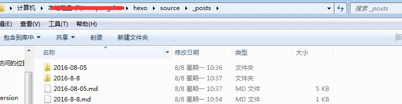

由于对markdown语法不是很熟，上篇博客都没有插图，今天研究了下在上篇博客补了两张图。下面记录下，怎么插入图片：

### 1.首先确认_config.yml 中有 post_asset_folder:true
然后执行如下命令下载hexo图片插件
`npm install https://github.com/CodeFalling/hexo-asset-image --save`

### 2.在md所在的目录下面创建和md同名的文件夹，如：
2016-08-05
├── xxx.png
└── xxxx.png
2016-08-05.md

然后使用``就可插入图片

# 注意如果是先下载的插件，当执行命令创建md的时候，会自动创建同名文件夹用来存放图片

生成的结构为
public/2016/08/05/2016-08-05
├── xxx.png
└── xxxx.png

生成的 html 是

``

