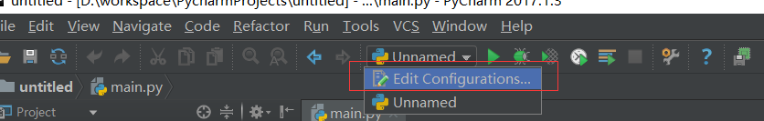
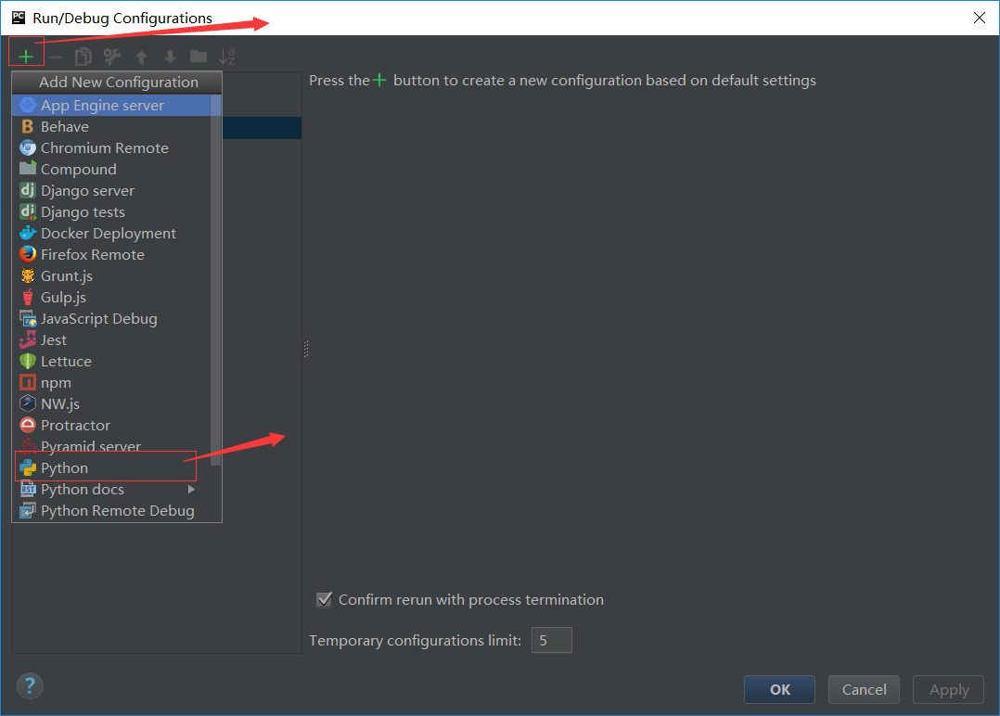
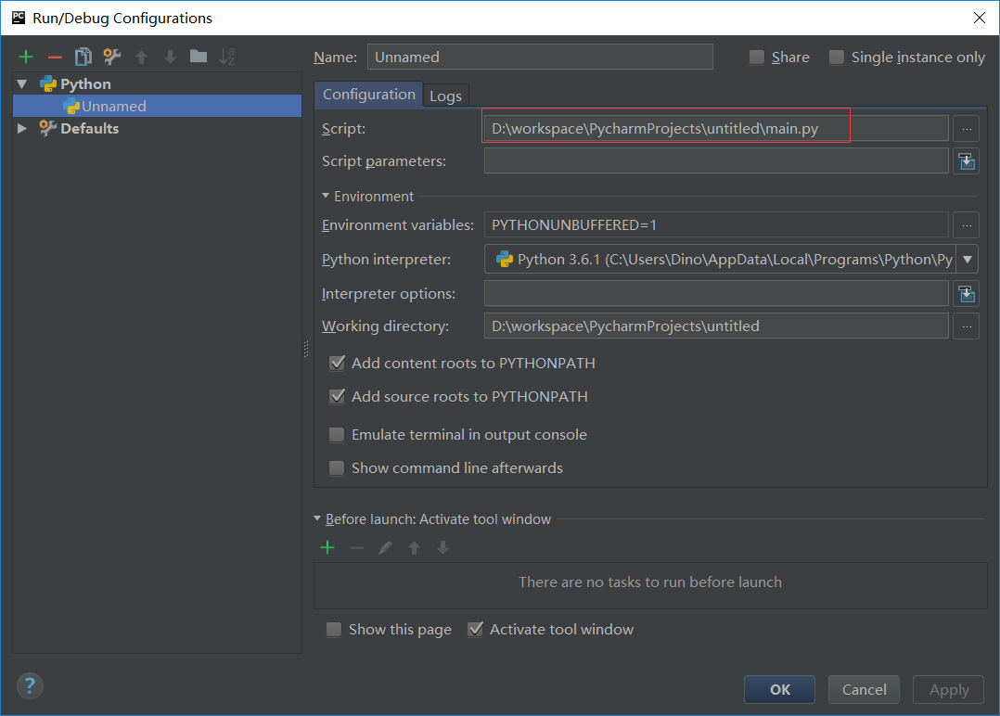
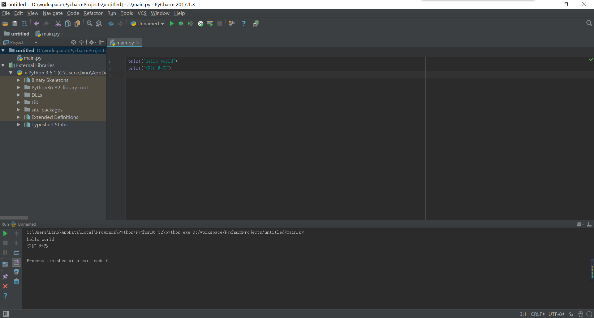

### Python解释器的选择
Python2.7.6是最稳定的版本了，但是现在有了3.x，而且语法上和2.x有区别。
本人纯属技术储备，当然是用最新的3.x啦，附上官网解释器下载地址[python 官网](https://www.python.org/)

### IDE 选择
本人电脑是windows，所以只说windows的情况。
python 是一种交互式语言，安装好解释器后可直接打开cmd窗口，输入python，回车即可在窗口开始编写程序，这里假定你安装的时候已经配置好了path
但是开发项目使用IDE可事半功倍，可选的有PyCharm，sublime text，Eclipse。
做android开发一直用的android studio，jetbrains这么牛x的IDE开发商，当然选PyCharm了
附上官网链接[PyCharm](https://www.jetbrains.com/pycharm/download/)
不过这个IDE是收费的，
在网上找的方案测试成功
server选项里边输入 http://elporfirio.com:1017/ 就可以了。 
不行再尝试： server选项里边输入 http://idea.imsxm.com/

### hello world
可以直接在cmd使用交互式特性进行编程，输入`print("hello world")`回车即可看到程序执行效果
使用IDE，新建python工程,在目录下新建python文件，写入`print("hello world")`，此时还无法运行，因为没有配置项目的入口脚本，
通过截图的步骤制定一个：

在scrip框里填入你的入口脚本

接下来按快捷键`shift+F10`即可运行，下面是运行效果图：
