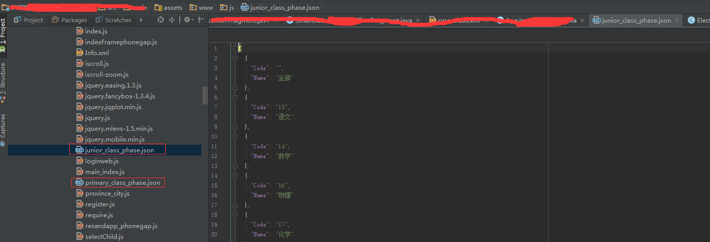

工作的新需求，需要加过滤，但是过滤的字段没有服务，只能像服务端一样写本地配置化。。。orz
把配置写成json格式放在assets下面。

### 1.构造json放在assets下面，如图


### 2.写一个util 代码如下
```java
import android.content.Context;
import android.content.res.AssetManager;

import org.json.JSONArray;
import org.json.JSONException;
import org.json.JSONObject;

import java.io.BufferedReader;
import java.io.IOException;
import java.io.InputStreamReader;
import java.util.ArrayList;
import java.util.HashMap;
import java.util.List;
import java.util.Map;

/**
 * Created by Dino on 8/9 0009.
 */
public class AppJsonFileReader {
    public static String getJson(Context context, String fileName) {

        StringBuilder stringBuilder = new StringBuilder();
        try {
            AssetManager assetManager = context.getAssets();
            BufferedReader bf = new BufferedReader(new InputStreamReader(
                    assetManager.open(fileName)));
            String line;
            while ((line = bf.readLine()) != null) {
                stringBuilder.append(line);
            }
        } catch (IOException e) {
            e.printStackTrace();
        }
        return stringBuilder.toString();
    }


    public static List<Map<String, String>> setListData(String str) {
        List<Map<String, String>> data = new ArrayList<Map<String, String>>();
        try {

            JSONArray array = new JSONArray(str);
            int len = array.length();
            Map<String, String> map;
            for (int i = 0; i < len; i++) {
                JSONObject object = array.getJSONObject(i);
                map = new HashMap<String, String>();
                map.put("Code", object.getString("Code"));
                map.put("Name", object.getString("Name"));
                data.add(map);
            }

        } catch (JSONException e) {
            e.printStackTrace();
        }
        return data;

    }
}
```


### 3.在activity里面调用代码：
```java
private final static String primary = "www/js/primary_class_phase.json";
private final static String junior = "www/js/junior_class_phase.json";
private final static String senior = "www/js/senior_class_phase.json";


new Thread(new Runnable() {
            @Override
            public void run() {
                String jsonStr="";
                if("2".equals(phase)){//小学
                    jsonStr = AppJsonFileReader.getJson(getActivity(),primary);
                }else if("3".equals(phase)){//初中
                    jsonStr = AppJsonFileReader.getJson(getActivity(),junior);
                }else if("4".equals(phase)){//高中
                    jsonStr = AppJsonFileReader.getJson(getActivity(),senior);
                }


                List<Map<String, String>> data = AppJsonFileReader.setListData(jsonStr);
                for(int i = 0;i<data.size();i++){
                    mCources.add(data.get(i).get("Name"));
                    mCourcesId.add(data.get(i).get("Code"));
                }
                list.clear();
                list.addAll(mCources);
                getActivity().runOnUiThread(new Runnable() {
                    @Override
                    public void run() {
                        mAdapter = new ArrayAdapter<String>(getActivity(), android.R.layout.simple_list_item_1, list);
                        mListView.setAdapter(mAdapter);
                    }
                });
            }
        }).start();
```