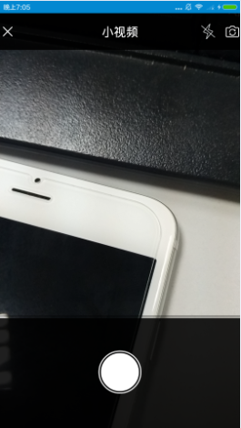
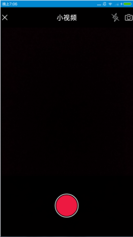

今天要做一个视频录制的功能，录制的按钮要和ios的一致，觉得用drawable实现更简单，下面先看看效果



### 1.新建一个record_normal_shape.xml 

```java
<?xml version="1.0" encoding="utf-8"?>
<layer-list xmlns:android="http://schemas.android.com/apk/res/android" >
    <item>
        <shape android:shape="oval" >
            <solid
                android:color="@color/white"/>
            <size android:width="20dp"
            android:height="20dp"/>
        </shape>
    </item>

    <item android:bottom="2dp"
        android:top="2dp"
        android:left="2dp"
        android:right="2dp">
        <shape android:shape="oval" >
            <solid
                android:color="@color/black"/>
            <size android:width="20dp"
                android:height="20dp"/>
        </shape>
    </item>

    <item android:bottom="4dp"
        android:top="4dp"
        android:left="4dp"
        android:right="4dp">
        <shape android:shape="oval" >
            <solid
                android:color="@color/white"/>
            <size android:width="20dp"
                android:height="20dp"/>
        </shape>
    </item>
</layer-list>
```

### 2.新建record_click_shape.xml 
代码基本和上面一样，只是颜色由白色变为红色
```java
<?xml version="1.0" encoding="utf-8"?>
<layer-list xmlns:android="http://schemas.android.com/apk/res/android" >
    <item>
        <shape android:shape="oval" >
            <solid
                android:color="@color/white"/>
            <size android:width="20dp"
            android:height="20dp"/>
        </shape>
    </item>

    <item android:bottom="2dp"
        android:top="2dp"
        android:left="2dp"
        android:right="2dp">
        <shape android:shape="oval" >
            <solid
                android:color="@color/black"/>
            <size android:width="20dp"
                android:height="20dp"/>
        </shape>
    </item>

    <item android:bottom="4dp"
        android:top="4dp"
        android:left="4dp"
        android:right="4dp">
        <shape android:shape="oval" >
            <solid
                android:color="@color/red"/>
            <size android:width="20dp"
                android:height="20dp"/>
        </shape>
    </item>
</layer-list>
```


### 3.新建record_statue_selector.xml
```java
<?xml version="1.0" encoding="utf-8"?>
<selector xmlns:android="http://schemas.android.com/apk/res/android">

    <item android:drawable="@drawable/record_click_shape" android:state_focused="true"/>
    <item android:drawable="@drawable/record_click_shape" android:state_pressed="true"/>
    <item android:drawable="@drawable/record_click_shape" android:state_selected="true"/>
    <item android:drawable="@drawable/record_normal_shape"/>

</selector>
```

### 4.直接在布局文件中添加background既可

```java
<ImageButton
                android:id="@id/btn_recorder_record"
                android:layout_width="70dp"
                android:layout_height="70dp"
                android:layout_centerInParent="true"
                android:background="@drawable/record_statue_selecter" />
```


实现起来很简单，这种方式不但可以画出圆形，还可以画矩形，直线，环形，椭圆。以及设置圆角，边线等等。