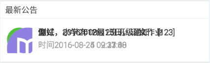
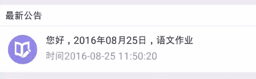

要做一个不停滚动的通知，类似banner，由于比较简单的功能，这里就没有用banner的框架，自己简单实现封装了下，最开始用的TimerTask，一开始用的挺正常的，可是放置时间久了后后界面就乱了。。。于是看了下开源banner框架的源码，别人用Handler postDelayed实现的。。。于是改改改，测试了下正常了，应该是线程的问题，暂时还不明白具体原因。

### 1.用TimerTask实现的乱掉的界面如图


### 2.用Handler实现的，如图


##### 2.1代码很简单，这里只做了简单的封装

```java
import android.content.Context;
import android.os.Handler;
import android.view.LayoutInflater;
import android.view.View;
import android.view.ViewGroup;
import android.view.animation.Animation;
import android.view.animation.TranslateAnimation;
import android.widget.RelativeLayout;

import com.tyky.edu.teacher.R;
import java.util.List;

/**
 * Created by Dino on 8/25 0025.
 */

public class NewNoticeBanner {
    private TranslateAnimation mShowAction;
    private TranslateAnimation mHiddenAction;
    private Context context;
    private int count =0;
    private ViewGroup parentView;
    private List<View> views;
    private boolean turning = false;
    private long autoTurningTime;
    private RelativeLayout rlNodata;
    private Handler timeHandler = new Handler();
    private Runnable adSwitchTask = new Runnable() {
        @Override
        public void run() {
            if (parentView != null && turning) {
                View view = parentView.getChildAt(0);
                if(view!=null){
                    view.setVisibility(View.GONE);
                    view.startAnimation(mHiddenAction);
                }
                parentView.removeAllViews();
                if(count<=views.size()-1){
                    parentView.addView(views.get(count));
                }else{
                    count=0;
                    parentView.addView(views.get(count));
                }
                views.get(count).setVisibility(View.VISIBLE);
                views.get(count).startAnimation(mShowAction);
                count++;
                timeHandler.postDelayed(adSwitchTask, autoTurningTime);
            }
        }
    };

    private static class Holder{
        static NewNoticeBanner INSTANCE = new NewNoticeBanner();
    }
    public static synchronized NewNoticeBanner getInstance() {
        return NewNoticeBanner.Holder.INSTANCE;
    }

    public NewNoticeBanner init(Context context,ViewGroup parentView){
        this.parentView = parentView;
        this.context = context;
        //初始化动画
        mShowAction = new TranslateAnimation(Animation.RELATIVE_TO_SELF, 0.0f,
                Animation.RELATIVE_TO_SELF, 0.0f,Animation.RELATIVE_TO_SELF,
                2.0f,Animation.RELATIVE_TO_SELF, 0.0f);
        mShowAction.setDuration(500);
        mHiddenAction = new TranslateAnimation(Animation.RELATIVE_TO_SELF,
                0.0f, Animation.RELATIVE_TO_SELF, 0.0f,
                Animation.RELATIVE_TO_SELF, 0.0f, Animation.RELATIVE_TO_SELF,-1.0f);
        mHiddenAction.setDuration(500);

        //初始化无数据布局
        rlNodata = (RelativeLayout) LayoutInflater.from(context).inflate(R.layout.new_notice_nodata,null);
        return this;
    }

    public NewNoticeBanner initViews(List<View> views){
        this.views = views;
        if(views==null||views.size()==0){
            parentView.removeAllViews();
            parentView.addView(rlNodata);
        }else if(views.size()==1){
            parentView.removeAllViews();
            parentView.addView(views.get(0));
        }
        return  this;
    }

    public void startTurning(long autoTurningTime) {
        if(views!=null&&views.size()>1) {
            //如果是正在翻页的话先停掉
            if (turning) {
                stopTurning();
            }
            turning = true;
            this.autoTurningTime = autoTurningTime;
            timeHandler.postDelayed(adSwitchTask, autoTurningTime);
        }
    }

    public void stopTurning() {
        turning = false;
        timeHandler.removeCallbacks(adSwitchTask);
    }

}

```

##### 2.2在activity里面调用

```java
private void initNoticeBanner(){
        new Thread(new Runnable() {
            @Override
            public void run() {
                getNewNotice();//查询数据库，然后新建子view
                getActivity().runOnUiThread(new Runnable() {
                    @Override
                    public void run() {
                        newNoticeBanner = NewNoticeBanner.getInstance().init(getActivity(),noticeRl).initViews(noticeViews);
                        onResume();
                    }
                });
            }
        }).start();
    }
@Override
    public void onStop() {
        super.onStop();
        stopBanner();
    }

    @Override
    public void onDestroy() {
        super.onDestroy();
        stopBanner();
    }

    @Override
    public void onResume() {
        super.onResume();
        startBanner();
    }

    private void startBanner(){
        if(newNoticeBanner!=null){
            newNoticeBanner.startTurning(3000);
        }
    }
    private void stopBanner(){
        if(newNoticeBanner!=null){
            newNoticeBanner.stopTurning();
        }
    }
```

由于数据库操作比较重，查询数据的地方最好写在子线程里，在后台运行或者跳到其他页面也要记得stop